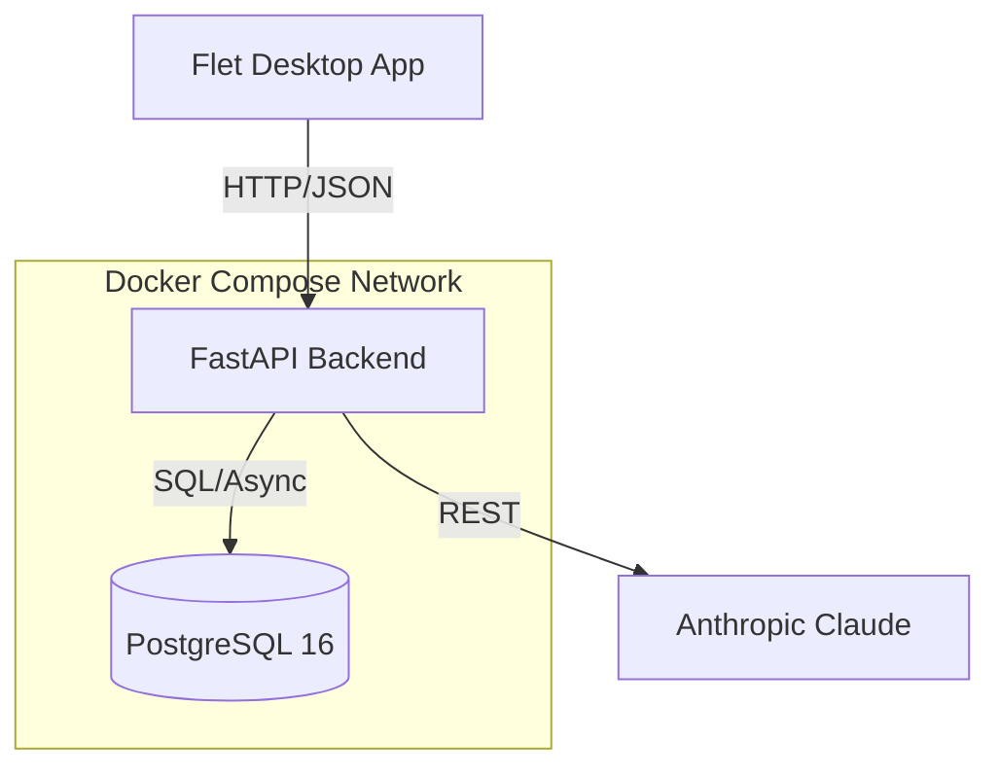

# Supersonic -- AI-Assisted Project Planner

An intelligent project planning tool that enables teams to import project plans, manage tasks through a modern desktop UI, and interact with a project-aware AI assistant powered by **Anthropic Claude**.

Built with a **Flet (Python) desktop frontend** and a **FastAPI + PostgreSQL** backend, deployed via **Docker**.

## Features

- **Project plan import** -- Upload `.csv` or `.xlsx` files to create a project with tasks in one step
- **Project & task management** -- Full CRUD with filtering by status, priority, and date range
- **AI Assistant** -- Project-aware chatbot for summaries, risk analysis, and tactical suggestions
- **Modern desktop UI** -- Flet-powered interface with navigation rail, Gantt charts, analytics dashboards, and conversational AI chat
- **Ethics & policy** -- Built-in endpoint documenting data handling and AI limitations
- **Security** -- JWT Bearer token auth with bcrypt password hashing

## Architecture



| Component       | Technology             | Role                                                         |
| --------------- | ---------------------- | ------------------------------------------------------------ |
| **Frontend**    | Flet 0.82.x (Python)   | Desktop UI with views, components, state management          |
| **API Client**  | httpx                  | HTTP communication with backend, JWT handling                |
| **Backend API** | FastAPI + Uvicorn      | REST/JSON endpoints, auth, file parsing, AI orchestration    |
| **Database**    | PostgreSQL 16          | Persistent storage for users, projects, tasks, messages      |
| **ORM**         | SQLAlchemy 2.0 (async) | Data models, async DB access via asyncpg                     |
| **Auth**        | python-jose + passlib  | JWT token issuance/verification, bcrypt password hashing     |
| **File import** | pandas + openpyxl      | Parses CSV and Excel uploads into structured project data    |
| **AI service**  | Anthropic Claude       | Reasoning engine for chat, summaries, and suggestions        |
| **Deployment**  | Docker Compose         | Two-container setup (backend + postgres) on a shared network |

## Data Model

```
User --1:N--> Project --1:N--> Task <--N:M--> Tag
                 |                |
                 +--1:N--> Message (optionally linked to a Task)
```

## API Endpoints

| Group        | Endpoints                                                          | Auth                    |
| ------------ | ------------------------------------------------------------------ | ----------------------- |
| **Auth**     | `POST /auth/register`, `POST /auth/login`, `GET /auth/me`          | public (register/login) |
| **Projects** | `POST /projects`, `GET /projects`, `GET/PUT/DELETE /projects/{id}` | Bearer token            |
| **Import**   | `POST /projects/import` (multipart file upload)                    | Bearer token            |
| **Tasks**    | `POST/GET /projects/{id}/tasks`, `GET/PUT/DELETE /tasks/{id}`      | Bearer token            |
| **Messages** | `POST/GET /projects/{id}/messages`                                 | Bearer token            |
| **AI**       | `POST /ai/summary`, `POST /ai/suggestions`, `POST /ai/chat`        | Bearer token            |
| **Policy**   | `GET /policy`                                                      | public                  |
| **Health**   | `GET /health`                                                      | public                  |

Full interactive docs available at `/docs` (Swagger UI) when the server is running.

## Project Structure

```
supersonic/
|
|   .env.example            # Environment variable template
|   docker-compose.yml      # PostgreSQL + backend services
|   Dockerfile              # Python 3.12 slim container
|   requirements.txt        # Python dependencies
|   README.md               # This file
|
+-- flet_app/               # Desktop frontend (Flet 0.82.x)
|   |   __init__.py
|   |   main.py             # App entry, routing, NavigationRail layout
|   |   state.py            # Centralized state (token, user, project)
|   |   theme.py            # Design system (colors, typography, factories)
|   |   api_client.py       # httpx HTTP client with JWT auth
|   |
|   +-- components/
|   |       nav_rail.py     # NavigationRail with destinations + sign-out
|   |       project_card.py # Clickable project card with stats
|   |       stat_card.py    # KPI display card (label + value)
|   |       task_row.py     # Task list item with badges and actions
|   |       gantt_chart.py  # Gantt chart built from Containers
|   |       chat_bubble.py  # User/bot chat message bubble
|   |       file_importer.py# FilePicker wrapper for CSV/Excel import
|   |
|   +-- views/
|           login_view.py   # Sign in / register screen
|           dashboard_view.py # Project portfolio overview
|           project_view.py # Project detail (Tasks, Gantt, Messages, AI)
|           analytics_view.py # Data visualization dashboard
|           ai_chat_view.py # Conversational AI interface
|
+-- app/                    # Backend (FastAPI)
|   |   main.py             # FastAPI app, router registration, DB init
|   |
|   +-- api/
|   |   |   deps.py         # get_db, get_current_user dependencies
|   |   +-- routes/
|   |           auth.py     # register, login, me
|   |           projects.py # CRUD + import
|   |           tasks.py    # CRUD with filtering
|   |           messages.py # create, list
|   |           ai.py       # summary, suggestions, chat
|   |           policy.py   # ethics/security policy
|   |
|   +-- core/
|   |       config.py       # pydantic Settings (reads .env)
|   |       security.py     # password hashing, JWT
|   |
|   +-- db/
|   |       base.py         # SQLAlchemy declarative base
|   |       models.py       # User, Project, Task, Tag, Message
|   |       session.py      # async engine + session factory
|   |
|   +-- schemas/            # Pydantic request/response models
|   |
|   +-- services/
|           ai_client.py    # Anthropic Claude integration
|           project_importer.py  # Excel/CSV parser
|
+-- tests/
```

## Quick Start

```bash
# 1. Clone the repo
git clone https://github.com/em-ech/supersonic.git
cd supersonic

# 2. Setup environment variables
cp .env.example .env
# Edit .env and add your ANTHROPIC_API_KEY

# 3. Build and run with Docker
docker-compose up --build

# 4. Verify backend
curl http://localhost:8000/health

# 5. Run Flet frontend
python3 -m flet_app.main
```

## Environment Variables

| Variable                      | Description                            | Value (example)                             |
| ----------------------------- | -------------------------------------- | ------------------------------------------- |
| `DATABASE_URL`                | Async PostgreSQL connection string     | `postgresql+asyncpg://user:pass@db:5432/db` |
| `SECRET_KEY`                  | JWT signing key (change in production) | `(random-secret)`                           |
| `ANTHROPIC_API_KEY`           | Anthropic API key for Claude           | `sk-ant-...`                                |
| `ACCESS_TOKEN_EXPIRE_MINUTES` | Token lifetime                         | `60`                                        |
| `SUPERSONIC_API_URL`          | Backend URL for Flet frontend          | `http://localhost:8002`                     |

## Security & Policy

- **bcrypt hashing** -- Passwords are never stored in plaintext.
- **JWT isolation** -- All project data is scoped to the authenticated owner.
- **Dedicated DB User** -- PostgreSQL accessed via a restricted service account.
- **AI Disclaimer** -- Built-in policy advising users on model limitations and data handling.

---

_Built for professional software development._
